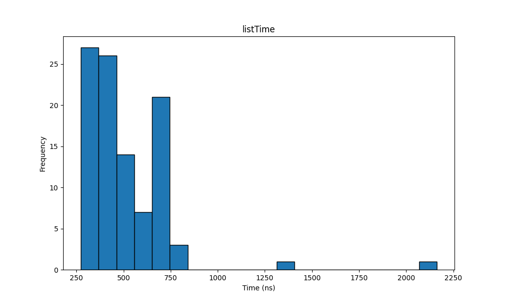
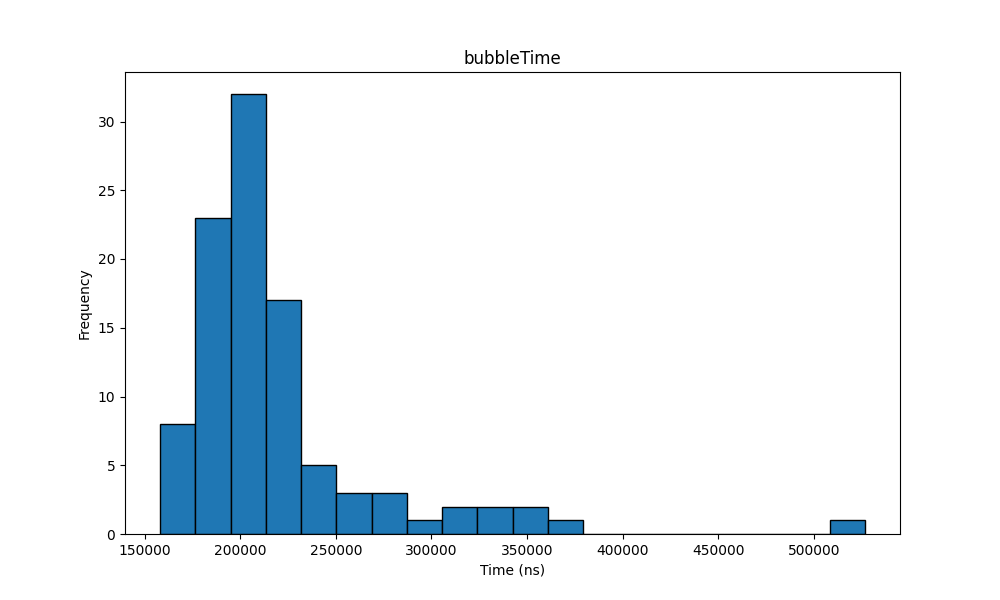
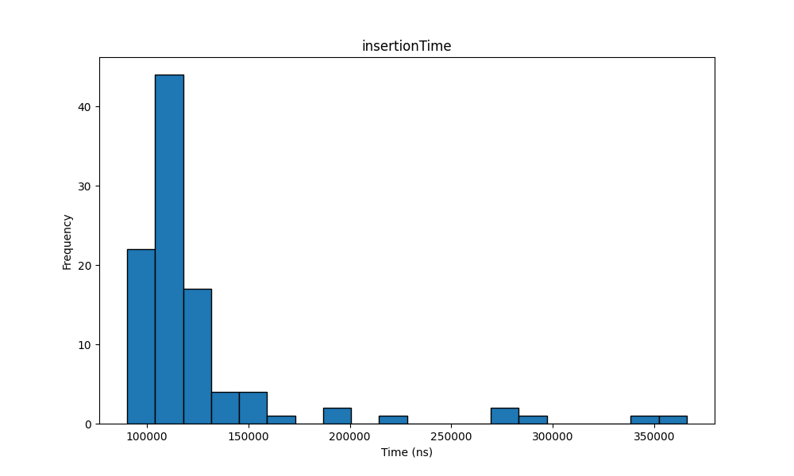
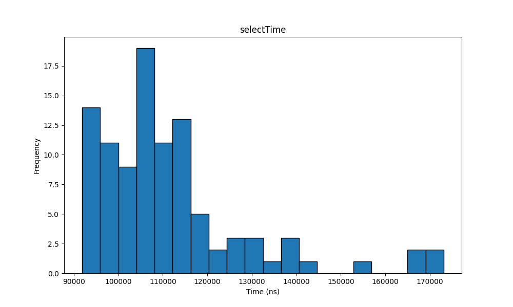
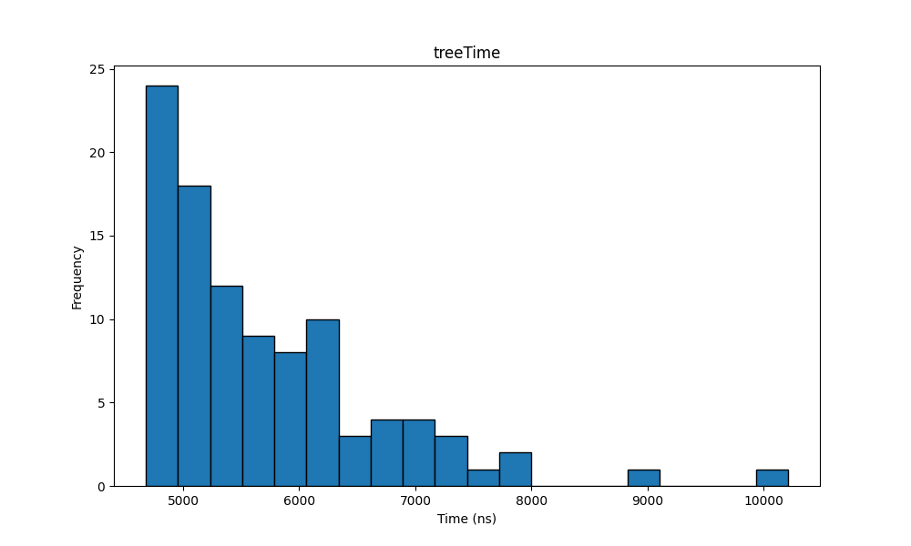
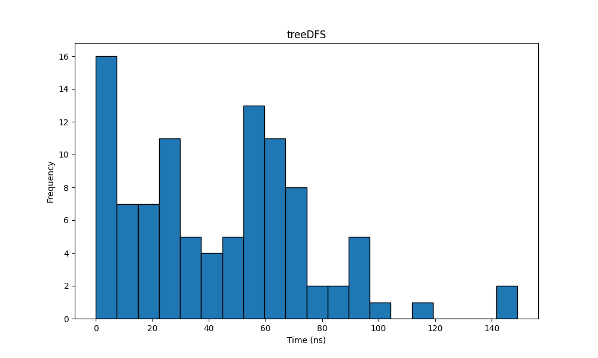
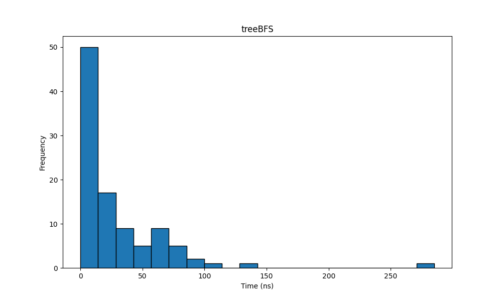

# Estruturas de Dados

As atividades aqui presentes foram desenvolvidas para a A2 de Estrutura de Dados (2024).
Além de implementadas listas duplamente encadadas e alguns algoritmos de ordenação, também foram feitas árvores binárias e seus métodos de busca. Abaixo segue uma breve análise de tempo desses processos. Em todos eles foram criadas 100 estruturas com 10000 inteiros cada, variando em valor de 1 a 100.

## Listas encadeadas

 |
:------------------:|

O tempo de criação de uma lista, como vemos acima, é extremamente baixo devido ao seu tempo de inserção ser $O(n)$. Também há poucos valores extremos, o que ajuda a manter sua a média em $512,66 ns$.

### Ordenações

 |
:--------------------:|

O bubble sort é conhecido como uma das piores ordenações por um bom motivo. Sua média de $219136,85 ns$ é imbatível pelos outros algoritmos.

 |
:-----------------------:|

O insertion apresenta um desempenho melhor, mas ainda alto, além de ter muitos outliers. Sua média foi de $125330,76 ns$.

 |
:--------------------:|

O selection desempenha de maneira semelhante ao insertion, mas com menos valores extremos. Isto explica sua média menor de $111509,26 ns$.

## Árvores

 |
:------------------:|

Criar árvores é muito custoso quando se tenta mantê-la ordenada. Vemos isto quando o histograma acima se assemelha a uma exponencial, e pela sua média de $5700,74 ns$. Não há dúvidas que as listas são mais rápidas.

### Buscas

 |
:-----------------:|

A busca por Depth-First é certamente rápida e um tanto uniforme, pela própria forma como ela é construída. A média é $43,98 ns$.

 |
:-----------------:|

Buscar por Breath-First teve um desempenho curiosamente melhor nesta amostragem, em parte explicado pela menor variação apresentada. Sua média de $28,36 ns$ é levemente menor do que a anterior.
